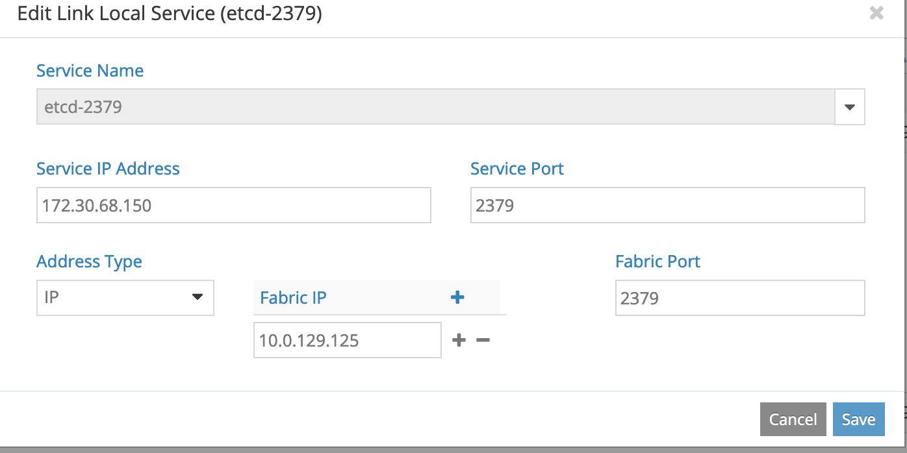
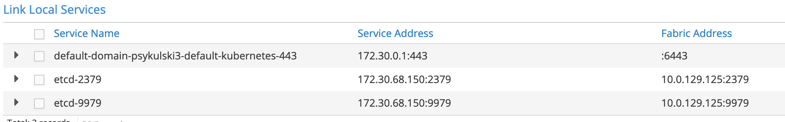

# Prerequisities
Deployment depends strongly on Openshift installation which is described in this [documentation](https://docs.openshift.com/container-platform/4.1/installing/installing_aws/installing-aws-customizations.html)

Prerequisities that have to be fulfilled in order to dpeloy Contrail with operator on Openshift:
* openshift-install binary ([download](https://cloud.redhat.com/openshift/install))
* Openshift pull secrets ([download](https://cloud.redhat.com/openshift/install/pull-secret))
* Configured AWS account with proper permissions and resolvable base domain configured in Route53 ([documentation](https://docs.openshift.com/container-platform/4.3/installing/installing_aws/installing-aws-account.html#installing-aws-account))
* Any SSH key generated on local machine to provide during installation
* (Optional) `oc` command line tool downloaded ([download](https://cloud.redhat.com/openshift/install))

# Deployment

1. Create install config with:
```
./openshift-install create install-config --dir <name of desired directory>
```
In created YAML file under specified directory setup all settings of cluster
under *networking* section change *networkType* field to *Contrail* (instead of *OpenshiftSDN*)

**NOTE**: Master nodes need larger instances.
For example, If you run cluster on AWS, use e.g. *m5.2xlarge*.

**NOTE**: See *install-config.example* for an example cluster configuration

2. Create manifests with
```
./openshift-install create manifests --dir <name of desired directory>
```

3. Build contrail-operator
Go to cloned directory with contrail-operator project and build operator
```
operator-sdk build <your container registry>/<name of your container>:<tag of container>
```
Afterwards push container
```
docker push <repo>/<name>:<tag>
```

4. Create configuration file
Create file with configuration parameters that looks similar to this:
```
CONTRAIL_OPERATOR_IMAGE=example/contrail-operator
DOCKER_CONFIG=example_json_config
```
Under *CONTRAIL_OPERATOR_IMAGE* field enter proper container image with the parameters of your pushed container.

*DOCKER_CONFIG* is configuration for registry secret to hub.juniper.net/contrail-nightly
Set *DOCKER_CONFIG* to registry secret with proper data in base64.

**NOTE:** You may create dummy secret on Kind in order to get proper base64 value:
```
kubectl create secret docker-registry contrail-registry --docker-server=hub.juniper.net/contrail-nightly --docker-username=<username> --docker-password=<password> --docker-email=<mail for registry> -n contrail

kubect -n contrail get secret contrail-registry -o yaml
```
Afterwards, copy the .dockerconfigjson field contents and paste it in the configuration file

6. Install manifest
Install manifests with:
```
/path/to/repo/install-manifests.sh --dir <name of openshift install directory> --operator-dir <path to operator directory> --config <path to config file>
```
**NOTE** If **--config** is not provided by default script will try to read config from script directory's file **config**

7. Modify cluster network config:
Open the  **\<Openshift install directory>/manifests/cluster-network-02-config.yml** in text editor. Copy the *clusterNetwork*, *networkType* and *serviceNetwork* fields from the *spec* to the *status*. Example modified file:
```
apiVersion: config.openshift.io/v1
kind: Network
metadata:
  creationTimestamp: null
  name: cluster
spec:
  clusterNetwork:
  - cidr: 10.128.0.0/14
    hostPrefix: 23
  externalIP:
    policy: {}
  networkType: Contrail
  serviceNetwork:
  - 172.30.0.0/16
status:
  clusterNetwork:
  - cidr: 10.128.0.0/14
    hostPrefix: 23
  networkType: Contrail
  serviceNetwork:
  - 172.30.0.0/16
```

8. Install Openshift
Run this command to start Openshift install:
```
./openshift-install create cluster --dir <name of openshift install directory>
```

9. Open security groups:

Login to AWS Console and find *master* instance created by the *openshift-installer*. Select Security Group attached to it and edit it's inbound rules to accept all traffic. Do the same for the security group attached to worker nodes, after they are created.

10. Create link-local service:

After *openshift-install* says that kubernetes API is up, with a message similar to this:
```
./4.3.5/openshift-install create cluster --dir ./psykulski3/
INFO Consuming Openshift Manifests from target directory
INFO Consuming Master Machines from target directory
INFO Consuming Common Manifests from target directory
INFO Consuming Worker Machines from target directory
INFO Consuming OpenShift Install (Manifests) from target directory
INFO Creating infrastructure resources...
INFO Waiting up to 30m0s for the Kubernetes API at https://api.psykulski3.psykulski.jnpr.com:6443...
INFO API v1.16.2 up
INFO Waiting up to 30m0s for bootstrapping to complete...
```

Export KUBECONFIG variable to point to use *kubectl* (for instruction see the *Access cluster* section)

Run:
```
kubectl -n contrail get pods
```

Wait until all pods, except the *vrouter* pods are running.

Run:
```
kubectl -n openshift-etcd describe service etcd
```

Login to the Contrail webui and use details from the command above to create two link-local services.

Example window in web UI to add link local.


Example of expected link locals created in web UI.


**NOTE**: Default domain link local should be created automatically by kubemanager - there's no need to manually add it.

# Access cluster
In order to access export **KUBECONFIG** environment variable.
**KUBECONFIG** file may be found under **<Openshift install directory>/auth/kubeconfig**
E.x.
```
export KUBECONFIG=<Openshift install directory>/auth/kubeconfig
```
Afterwards cluster may be accessed with `kubectl` command line tool.

It's also possible to access cluster with dedicated Openshift command line tool: `oc`.
However, `oc` requires to login before.
After successful deployment **openshift-install** binary prints out username (**kubeadmin**) and password to cluster.
Password may be also found also under **<Openshift install directory>/auth/** directory.

Login into `oc` may be performed with this command:
```
oc login -u kubeadmin -p <cluster password>
```

Last method to access Openshift cluster is web console.
URL to web console will be displayed by **openshift-install** binary at the end of deployment.
Login into console with the same credentials as for `oc`.
