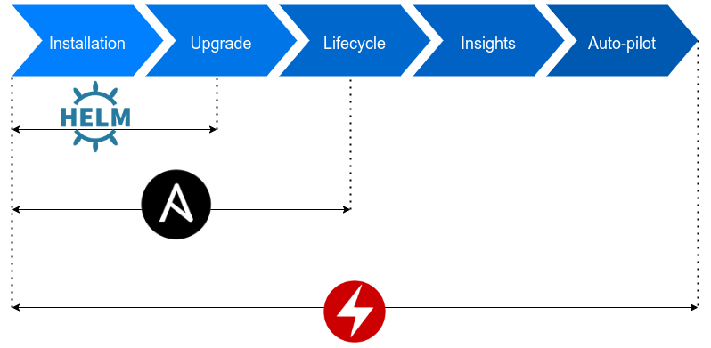

# Contrail Operator 101

## What is an operator?

Operator is an automated software extension which allow to easily manage applications and its' components.<br/>
It's used to package, deploy and manage applications based on Kubernetes custom resources.

Operator acts as a controller which extend Kubernetes API to manage lifecycle of dependent application resources. Controller implements logic which periodically compare desired state of a cluster to it's actual state and apply corrections to meet declared state.

Compared to other methods of managing application deployment on Kubernetes clusters, operator allows to cover completly lifetime of application.<br/>
Below graph compares operator to Helm and Ansible.<br/>
Helm provides only installation process with some mechanisms of upgrade.
Ansible additionaly allow to cover some aspects of managing application resources lifecycle.<br/>
However, only operator allows to have full insights into created cluster resources and perform custom operations on them during lifecycle.



Custom operator may be written in multiple languages as in fact it's just a piece of code that periodically act with requests to Kubernetes API.<br/>
Currently, the most popular language to write operators is the language that was used to write Kubernetes project itself - Go.<br/>
Helpful tool for creating operators is [Operator Framework](https://github.com/operator-framework) which distributes [Operator-SDK](https://github.com/operator-framework/operator-sdk) commonly used to create operators - for example this operator.

Every custom resource built with operator contains 2 elements.<br/>
First element is API which defines how resource is defined and what's it's structure.
This definition is used afterwards by Operator Framework to generate CRD manifests applied on a cluster and defines how user should write manifests to deploy custom resource successfully.<br/>
Second element is controller which runs on an operator pod and handles logic of custom resource.
Every controller use Kubernetes watch API to observe state of the cluster and if necessary trigger Reconcile method containing code which defines what to do.
Commonly, it creates, deletes or updates standard Kubernetes resources like pods, sets, secrets etc.

## How does it work here?

This operator implements custom resources for Contrail deployment.<br/>
Before contrail-operator there was used project [contrail-ansible-deployer](https://github.com/tungstenfabric/tf-ansible-deployer) which contained
set of ansible playbooks that setup instances based on a file with configuration.
This method took a lot time and could often fail, because of connection lost between bootstraping instance and cluster or unexpected failure.

With contrail-operator all that's required is Kubernetes cluster (or Kubernetes-like cluster e.g. Openshift) and one manifest in common format similar to definition of simple Pod or Daemonset.<br/>
Applying manifest on cluster will create all required resources to deploy successfully Contrail and status of all components is available to check at any time of deployment as well as during lifetime of a cluster.

Contrail may be configured in a various ways of configuration for various infrastructures.<br/>
Example infrastructure would be below cluster with 3 master nodes and 3 worker nodes.


Master node contains Contrail controller components.<br/>
Rabbitmq, Zookeeper and Cassandra create database with configuration.<br/>
From configuration database Config components takes or stores current configuration of cluster.<br/>
Configuration may be set with WebUI and it's read and propagated by Control components to vRouters which manage networking on an interface on remote machines that are managed by Contrail.<br/>
Controller also contains Kubemanager component which gathers information from Kubernetes cluster and provides it to configuration.<br/>
vRouters mounted on every node control networking traffic on an interface with rules defined by agent that gethers rules from control node.<br/>
Controller components may also have more than one replica spread across multiple nodes which make Contrail work in HA mode.<br/>

In order to deploy such infrastructure on Kubernetes cluster it's necessary to create manifest which defines Manager custom resource.<br/>
Manager is a single resource which defines Contrail cluster.<br/>
In it's definition user defines which components should be created and with what configuration.
For reference on example Manager manifest which implements infrastructure showed above refer to [this](https://github.com/Juniper/contrail-operator/blob/master/deploy/openshift/manifests/0000000-contrail-09-manager.yaml) file.

However, Kubernetes cluster by default does not know what is Manager resource how to implement it's deployment.<br/>
Because of that it's necessary to beforewards apply all CRDs (Custom Resource Definitions) to cluster which in this repository are located under [*deploy/crds*](https://github.com/Juniper/contrail-operator/tree/master/deploy/crds) directory.<br/>
While Kubernetes cluster will now properly read manifests for Contrail custom resources, it does not have logic that should be used in order to properly controll resources.


To fix that problem, operator itself has to be deployed on cluster.<br/>
Example manifest may be found [here](https://github.com/Juniper/contrail-operator/blob/master/deploy/openshift/manifests/0000000-contrail-08-operator.yaml).
Applied operator will create separate Pod which will act as controller of custom resources in cluster.

Afterwards, when manifest is applied on cluster in namespace *contrail* (*contrail* namespace has to be created beforehand) may be observed status of all pods created by Contrail.<br/>
Because operator allows to create custom logic in code, some components wait for other components to be deployed in order to start its' Pods which protects deployment against race conditions and potential failures.

After example infrastructure is deployed following Pods run in contrail namespace:

```
$ kubectl get pods -n contrail
NAME                                          READY   STATUS             RESTARTS   AGE
cassandra1-cassandra-statefulset-0            1/1     Running            0          39m
cassandra1-cassandra-statefulset-1            1/1     Running            0          39m
cassandra1-cassandra-statefulset-2            1/1     Running            0          39m
config1-config-statefulset-0                  10/10   Running            0          38m
config1-config-statefulset-1                  10/10   Running            0          38m
config1-config-statefulset-2                  10/10   Running            0          39m
contrail-operator-dd5bb5c-klqwb               1/1     Running            0          42m
control1-control-statefulset-0                4/4     Running            0          30m
control1-control-statefulset-1                4/4     Running            0          30m
control1-control-statefulset-2                4/4     Running            0          30m
kubemanager1-kubemanager-statefulset-0        2/2     Running            0          30m
kubemanager1-kubemanager-statefulset-1        2/2     Running            0          30m
kubemanager1-kubemanager-statefulset-2        2/2     Running            0          30m
provmanager1-provisionmanager-statefulset-0   1/1     Running            0          30m
rabbitmq1-rabbitmq-statefulset-0              1/1     Running            0          39m
rabbitmq1-rabbitmq-statefulset-1              1/1     Running            0          39m
rabbitmq1-rabbitmq-statefulset-2              1/1     Running            0          39m
vroutermasternodes-vrouter-daemonset-rgl4t    1/1     Running            0          28m
vroutermasternodes-vrouter-daemonset-ttc7c    1/1     Running            0          28m
vroutermasternodes-vrouter-daemonset-wn6qg    1/1     Running            0          28m
vrouterworkernodes-vrouter-daemonset-gs4bw    1/1     Running            0          5m
vrouterworkernodes-vrouter-daemonset-p7zkw    1/1     Running            0          5m
vrouterworkernodes-vrouter-daemonset-pqfw9    1/1     Running            0          5m
webui1-webui-statefulset-0                    3/3     Running            0          30m
webui1-webui-statefulset-1                    3/3     Running            0          30m
webui1-webui-statefulset-2                    3/3     Running            0          30m
zookeeper1-zookeeper-statefulset-0            1/1     Running            0          8m
zookeeper1-zookeeper-statefulset-1            1/1     Running            0          8m
zookeeper1-zookeeper-statefulset-2            1/1     Running            0          8m
```
That's just one resource type which all te custom Contrail resources create in cluster during deployment.<br/>
Below graph shows all resources created by Contrail during deployment with just one simple definition of single Manager custom resource.


## Miscellaneous elements of deployment

Deployment described in previous section is just a core solution of contrail-operator.<br/>
However, for different platforms, deployment may vary.<br/>
Because of that in this repository are defined additional components which allow to deploy operatorized Contrail with platforms like Openstack or Openshift.

### Openshift deployment use case example
For example, to deploy described above infrastructure to Openshift, it's necessary to apply some additional resources.<br/>
Openshift is based on CoreOS nodes which have generally read-only filesystem and limited system tools for configuration during runtime.<br/>
CoreOS is designed to be configured buring boot process with so called ingition configs and then work with persistent configuration.<br/>
Because of that [here](https://github.com/Juniper/contrail-operator/tree/master/deploy/openshift/openshift) are some ignition configs applied as custom resources managed by operator delivered by Openshift. For example nftables rules required by Contrail are applied with ignition files or there's created overlay mount of */lib/modules* directory in order to allow mount of vRouter kernel module.

Openshift deployment process from version 4 is based all on operators. It means that every feature of this platform is deployed as set of custom resources managed by operator. Because of that, contrail-operator works great deploying CNI plugin on cluster during Openshift installation. Openshift installation process is all defined with manifests similar to manifests created for Contrail created by Openshift just before cluster install which means that Contrail [manifests](https://github.com/Juniper/contrail-operator/tree/master/deploy/openshift/manifests) may just be added to other install manifests and will be applied on cluster during install process.

More on Opennshift install process with Contrail as CNI [here](https://github.com/Juniper/contrail-operator/tree/master/deploy/openshift).
